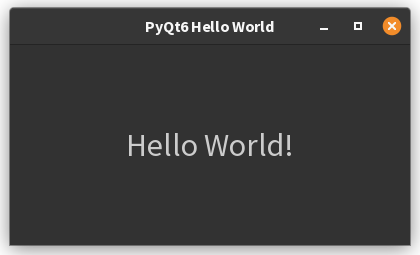

# 1. Creating Your First GUI Application

**PyQt6** is a powerful toolkit for developing cross-platform graphical user interface (GUI) applications using 
Python. It
provides Python bindings for the Qt framework, allowing developers to create professional-looking desktop applications
that run on Windows, macOS, and Linux platforms. This guide will introduce you to PyQt6 with a simple *Hello World*
application and cover installation procedures.

## Installing PyQt6

PyQt6 can be installed either through the command line using `pip` or through the PyCharm IDE interface. Here are
instructions for both methods:

### Command Line Installation

Installing PyQt6 is straightforward using `pip`, Python's package installer. Open your command prompt or terminal 
and run the following command:

```
pip install PyQt6
```

For Mac users, you might need to use `pip3` instead:

```
pip3 install PyQt6
```

You can verify the installation by checking the version:

```
pyuic6 --version
```

If the command displays version information, PyQt6 is successfully installed[5].

### Installing PyQt6 through PyCharm

If you're using PyCharm IDE, you can install PyQt6 through its built-in package manager:

1. Open your Python project in PyCharm
2. Go to `File > New Project Setup > Settings` (or `File > Settings` for existing projects)
3. Navigate to `Python Interpreter` section
4. Select the appropriate Python interpreter for your project
5. Click the `+` icon to add a new package
6. Search for `PyQt6` in the search box
7. Select `PyQt6` and click `Install Package`
8. Once completed, you'll see a success message: `Package PyQt6 installed successfully`[3]

Alternatively, you can use the *Python Packages* tool window to install PyQt6. Here’s how you can do it:

1. **Open PyCharm and Your Project**  
   Launch PyCharm and open the project where you want to install PyQt6.

2. **Locate the Python Packages Tool Window**  
   - Look at the bottom or side panel of the PyCharm interface for the **Python Packages** tool window.  
   - If you don’t see it, you can open it from the sidebar or via `View > Tool Windows > Python Packages`[3][5].

3. **Search for PyQt6**  
   - In the search bar at the top of the Python Packages window, type `PyQt6`[3][5].
   - PyCharm will show you the PyQt6 package (and possibly related packages).

4. **Install PyQt6**  
   - Click on `PyQt6` in the search results.
   - You’ll see an **Install** button next to the package name. Click it to start the installation[3][5].
   - Optionally, you can select a specific version before installing[2][5].

5. **Verify Installation**  
   - After installation, `PyQt6` should appear in your list of installed packages in the same window[3].
   - You can now import and use PyQt6 in your project.

!!! info "Tips"  

    - The Python Packages tool window also allows you to view package documentation, upgrade, or uninstall packages 
      easily[3][4][5].
    - Always make sure you have the correct Python interpreter selected for your project to avoid installation issues[1][2].


## Your First PyQt6 Application: Hello World

Let's create a simple PyQt6 application that displays a "Hello World" message in a centered label. This basic example
will introduce you to the fundamental concepts of PyQt6 programming.

```python
import sys
from PyQt6.QtWidgets import QApplication, QWidget, QLabel, QVBoxLayout
from PyQt6.QtCore import Qt


class MainWindow(QWidget):
    def __init__(self):
        super().__init__()

        # Set window properties
        self.setWindowTitle("PyQt6 Hello World")
        self.setGeometry(100, 100, 400, 200)  # x, y, width, height

        # Create a label with text
        label = QLabel("Hello World!")

        # Set font size for better visibility
        font = label.font()
        font.setPointSize(20)
        label.setFont(font)

        # Create layout and add label
        layout = QVBoxLayout()
        layout.addWidget(label)

        # Center the label in the layout
        label.setAlignment(Qt.AlignmentFlag.AlignCenter)

        # Apply layout to the window
        self.setLayout(layout)


if __name__ == '__main__':
    # Create the application
    app = QApplication(sys.argv)

    # Create and show the main window
    window = MainWindow()
    window.show()

    # Start the event loop
    sys.exit(app.exec())
```



## Understanding the Code

Let's break down the Hello World example to understand how PyQt6 works:

### Basic Structure and Imports

```python
import sys
from PyQt6.QtWidgets import QApplication, QWidget, QLabel, QVBoxLayout
from PyQt6.QtCore import Qt
```

These lines import the necessary modules from PyQt6:

- `QApplication`: The foundation for any PyQt application
- `QWidget`: The base class for all UI objects
- `QLabel`: Widget for displaying text
- `QVBoxLayout`: Vertical layout manager
- `Qt`: Contains various constants and enumerations[4][8]

### Creating the Application

```python
app = QApplication(sys.argv)
```

This creates a QApplication instance. Every PyQt application must have exactly one QApplication object, which manages
the application's control flow and main settings. The `sys.argv` parameter allows the application to accept command-line
arguments, though it's not necessary for simple applications[4].

### Defining the Main Window

We create a custom class `MainWindow` that inherits from `QWidget`. In the constructor:

1. We set the window title and dimensions with `setWindowTitle()` and `setGeometry()`
2. We create a `QLabel` widget with the text "Hello World!"
3. We increase the font size for better visibility
4. We create a vertical layout (`QVBoxLayout`) and add our label to it
5. We center the label using `setAlignment()`
6. We apply the layout to our window with `setLayout()`[8]

### Starting the Application

```python
window = MainWindow()
window.show()
sys.exit(app.exec())
```

These lines create an instance of our MainWindow, display it on screen with `show()`, and start the application's event
loop with `app.exec()`. The event loop is responsible for processing user interactions and updating the UI[4].

## Conclusion

This introduction has covered the basics of PyQt6: installation, creating a simple window, and adding a centered label.
The "Hello World" example demonstrates the fundamental structure of a PyQt6 application, including:

1. Creating an application object
2. Setting up a window
3. Adding widgets (in this case, a label)
4. Arranging widgets using layouts
5. Running the application's event loop

As you continue learning PyQt6, you'll discover many more widgets and features that allow you to create sophisticated
desktop applications. You can build on this foundation to add buttons, input fields, menus, dialogs, and much more.

For beginners just starting with GUI programming, PyQt6 offers a good balance between ease of use and powerful features,
making it an excellent choice for Python developers looking to create desktop applications.

??? note "References"

     - [1] https://wiki.qt.io/Qt_for_Python_Tutorial_HelloWorld
     - [2] https://discuss.python.org/t/pyqt6-module-not-found/67372
     - [3] https://www.youtube.com/watch?v=JXRWwYzeDLc
     - [4] https://doc.qt.io/qtforpython-6/tutorials/basictutorial/widgets.html
     - [5] https://abhinavtej.hashnode.dev/installing-pyqt6-and-pyside6-on-windows-and-mac
     - [6] https://pythonpyqt.com/how-to-install-pyqt5-in-pycharm/
     - [7] https://pythonbasics.org/pyqt-hello-world/
     - [8] https://www.pythontutorial.net/pyqt/pyqt-qlabel/
     - [9] https://www.pythonguis.com/tutorials/pyqt6-creating-your-first-window/
     - [10] https://python-qt-tutorial.readthedocs.io/en/latest/1.hello.html
     - [11] https://www.youtube.com/watch?v=FoD7MOm4KY4
     - [12] https://www.youtube.com/watch?v=NU3DQwMKz00
     - [13] https://stackoverflow.com/questions/71491747/pycharm-support-for-pyqt6-on-m1
     - [14] https://www.tutorialspoint.com/pyqt/pyqt_qlabel_widget.htm
     - [15] https://www.pythonguis.com/installation/install-pyqt6-mac/
     - [16] https://discuss.python.org/t/solved-module-pyqt6-not-found/33554
     - [17] https://www.pythonguis.com/tutorials/pyqt6-widgets/
     - [18] https://pypi.org/project/PyQt6/
     - [19] https://youtrack.jetbrains.com/issue/PY-51291/PyQt6-support
     - [20] https://stackoverflow.com/questions/21538615/hello-world-in-pyqt


---------------

??? info "Use of AI"
        Page written in part with the help of an AI assistant, mainly using Perplexity AI. The AI was used to generate
        explanations, examples and/or structure suggestions. All information has been verified, edited, and completed 
        by the author.