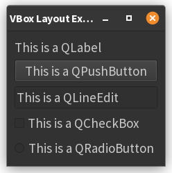
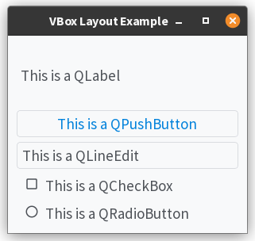
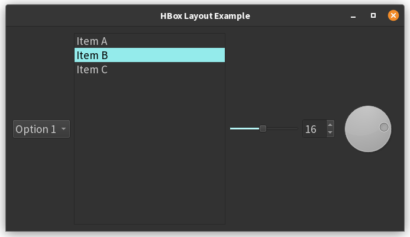

# 4. Box Layouts Examples

## `QVBoxLayout` Example

Here is a simple example of using a `QVBoxLayout` in PyQt6 to arrange multiple widgets-`QLabel`, `QPushButton`,
`QLineEdit`, `QCheckBox`, and `QRadioButton`-vertically in a window. This example does not connect any event functions;
the widgets are for display only.

```python
import sys
from PyQt6.QtWidgets import (
    QApplication, QWidget, QVBoxLayout,
    QLabel, QPushButton, QLineEdit, QCheckBox, QRadioButton
)


class MainWindow(QWidget):
    def __init__(self):
        super().__init__()
        self.setWindowTitle("VBox Layout Example")

        # Create the layout
        layout = QVBoxLayout()

        # Create widgets
        label = QLabel("This is a QLabel")
        button = QPushButton("This is a QPushButton")
        line_edit = QLineEdit("This is a QLineEdit")
        checkbox = QCheckBox("This is a QCheckBox")
        radio_button = QRadioButton("This is a QRadioButton")

        # Add widgets to the layout (top to bottom)
        layout.addWidget(label)
        layout.addWidget(button)
        layout.addWidget(line_edit)
        layout.addWidget(checkbox)
        layout.addWidget(radio_button)

        # Set the layout on the main window
        self.setLayout(layout)


if __name__ == '__main__':
    app = QApplication(sys.argv)
    window = MainWindow()
    window.show()
    sys.exit(app.exec())
```



**How it works:**

- A `QVBoxLayout` is created and assigned to the window.
- Each widget is created and added to the layout using `addWidget`, so they appear stacked vertically in the order
  added.
- No event handlers are connected; the widgets are static for now.

This pattern is the standard approach for arranging widgets vertically in PyQt6 and can be easily extended or modified
as your application grows[2][4][5].

??? note "References"
    - [1] https://stackoverflow.com/questions/52692943/pyqt5-trying-to-use-qgridlayout-to-organise-my-qlabel-qlineedit-qpushbutton-a
    - [2] https://www.pythonguis.com/tutorials/pyqt6-layouts/
    - [3] https://realpython.com/python-pyqt-gui-calculator/
    - [4] https://www.pythontutorial.net/pyqt/pyqt-qvboxlayout/
    - [5] https://python-qt-tutorial.readthedocs.io/en/latest/3.layout.html
    - [6] https://www.pythonguis.com/tutorials/pyqt6-widgets/
    - [7] https://www.pythonguis.com/tutorials/pyqt-basic-widgets/
    - [8] https://doc.qt.io/qtforpython-6/PySide6/QtWidgets/QVBoxLayout.html
    - [9] https://github.com/pyqt/examples/blob/_/src/02%20PyQt%20Widgets/main.py
    - [10] https://realpython.com/python-pyqt-layout/
    - [11] https://stackabuse.com/working-with-pythons-pyqt-framework/
    - [12] https://stackoverflow.com/questions/75810922/how-to-add-repeat-the-same-widget-on-qvboxlayout
    - [13] https://www.pythonguis.com/tutorials/pyqt6-signals-slots-events/
    - [14] https://doc.qt.io/qt-6/qpushbutton.html
    - [15] https://forum.qt.io/topic/96888/making-widgets-touch-stick-together-in-a-layout
    - [16] https://stackoverflow.com/questions/78165786/pyqt6-custom-signals-and-slots-connection
    - [17] https://build-system.fman.io/pyqt5-tutorial
    - [18] https://stackoverflow.com/questions/26614310/works-with-qgridlayout-not-with-qvboxlayout
    - [19] https://www.pythontutorial.net/pyqt/pyqt-qradiobutton/
    - [20] https://forum.qt.io/topic/138719/how-can-attributes-of-a-widget-that-triggered-a-clicked-connect-function-call-be-accessed


## Setting a light theme

One issue with the previous example is that with the default dark theme used by the operating system on which these 
notes and examples are written, the checkboxes and the radio buttons are not clearly visible. A more complete coverage
of themes will come in a later section, but for now, here is a simple way to set a light theme for an application.

1. Install the `pyqtdarktheme` package with the command `pip install pyqtdarktheme`, or through the IDE's package 
   manager.
2. Import the package at the top of the file with `import qdarktheme`.
3. Set the application's stylesheet this way:
```python
if __name__ == '__main__':
    app = QApplication(sys.argv)
    app.setStyleSheet(qdarktheme.load_stylesheet("light"))
    window = MainWindow()
    window.show()
    sys.exit(app.exec())
```

And you get:



## `QVBoxLayout` Example

Here is a simple PyQt6 example using a `QHBoxLayout` to arrange a `QComboBox`, `QListWidget`, `QSlider`, `QSpinBox`, and
`QDial` horizontally in a window. This example does not connect any event handlers; the widgets are just displayed side
by side:

```python
import sys
from PyQt6.QtWidgets import (
    QApplication, QWidget, QHBoxLayout,
    QComboBox, QListWidget, QSlider, QSpinBox, QDial
)
from PyQt6.QtCore import Qt


class MainWindow(QWidget):
    def __init__(self):
        super().__init__()
        self.setWindowTitle("HBox Layout Example")

        # Create the layout
        layout = QHBoxLayout()

        # Create widgets
        combo = QComboBox()
        combo.addItems(["Option 1", "Option 2", "Option 3"])

        list_widget = QListWidget()
        list_widget.addItems(["Item A", "Item B", "Item C"])

        slider = QSlider(Qt.Orientation.Horizontal)
        slider.setMinimum(0)
        slider.setMaximum(100)
        slider.setValue(50)

        spinbox = QSpinBox()
        spinbox.setMinimum(0)
        spinbox.setMaximum(100)
        spinbox.setValue(10)

        dial = QDial()
        dial.setMinimum(0)
        dial.setMaximum(100)
        dial.setValue(25)

        # Add widgets to the layout (left to right)
        layout.addWidget(combo)
        layout.addWidget(list_widget)
        layout.addWidget(slider)
        layout.addWidget(spinbox)
        layout.addWidget(dial)

        # Set the layout on the main window
        self.setLayout(layout)


if __name__ == '__main__':
    app = QApplication(sys.argv)
    window = MainWindow()
    window.show()
    sys.exit(app.exec())
```



**How it works:**

- A `QHBoxLayout` is created and set as the window's layout.
- Each widget is created and configured with some example data.
- The widgets are added to the layout in the order: `QComboBox`, `QListWidget`, `QSlider`, `QSpinBox`, `QDial`.
- The result is a window with all five widgets arranged horizontally, side by side[2][3][5][9].

This is a standard approach for arranging widgets horizontally in PyQt6.

??? note "References"
    - [1] https://www.pythonguis.com/tutorials/pyqt6-layouts/
    - [2] https://www.pythontutorial.net/pyqt/pyqt-qhboxlayout/
    - [3] https://doc.qt.io/qt-6/qhboxlayout.html
    - [4] https://zetcode.com/pyqt6/layout/
    - [5] https://www.tutorialspoint.com/pyqt/pyqt_qhboxlayout.htm
    - [6] https://www.pythontutorial.net/pyqt/pyqt-qcombobox/
    - [7] https://doc.qt.io/qt-6/qtwidgets-layouts-basiclayouts-example.html
    - [8] https://doc.qt.io/qt-6/qcombobox.html
    - [9] https://realpython.com/python-pyqt-layout/
    - [10] https://www.pythonguis.com/tutorials/pyqt6-widgets/
    - [11] https://www.youtube.com/watch?v=Cc_zaUbF4LM
    - [12] https://www.pythonguis.com/tutorials/pyqt-basic-widgets/
    - [13] https://www.pythonguis.com/tutorials/pyqt6-qt-designer-gui-layout/
    - [14] https://doc.qt.io/qt-6/stylesheet-examples.html
    - [15] https://stackoverflow.com/questions/77107483/change-qhboxlayout-border-color-when-widget-clicked
    - [16] https://forum.qt.io/topic/158910/pyqt6-selecting-multiple-items-from-a-qcombobox
    - [17] https://www.youtube.com/live/WnHkx-AvTBA
    - [18] https://doc.qt.io/qt-6/qslider.html
    - [19] https://doc.qt.io/qtforpython-6/PySide6/QtWidgets/QSlider.html
    - [20] https://stackoverflow.com/questions/67086226/qtable-get-qspinbox-qcombobox-value
