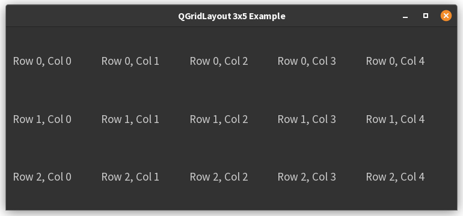
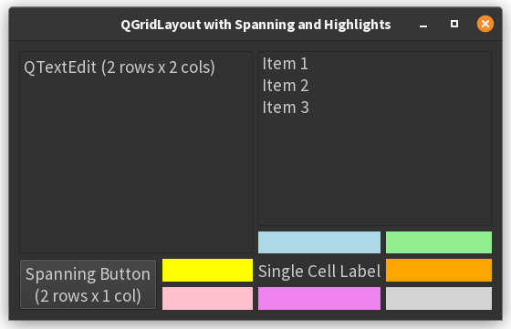

# 5. Grid Layout Examples

## Example 1

Here’s how you can create a **3 by 5 grid** (3 rows and 5 columns) using `QGridLayout` and `QLabel` widgets in PyQt6.
Each label will indicate its cell’s row and column:

```python
import sys
from PyQt6.QtWidgets import QApplication, QWidget, QLabel, QGridLayout


class MainWindow(QWidget):
    def __init__(self):
        super().__init__()
        self.setWindowTitle("QGridLayout 3x5 Example")

        # Create a QGridLayout instance
        layout = QGridLayout()

        # Add QLabel widgets to the 3x5 grid
        for row in range(3):
            for col in range(5):
                label = QLabel(f"Row {row}, Col {col}")
                layout.addWidget(label, row, col)

        # Set the layout on the main window
        self.setLayout(layout)


if __name__ == '__main__':
    app = QApplication(sys.argv)
    window = MainWindow()
    window.show()
    sys.exit(app.exec())
```



### How it works

- The outer loop runs for 3 rows (`range(3)`)
- The inner loop runs for 5 columns (`range(5)`)
- Each cell of the grid is filled with a `QLabel` indicating its row and column position

This will display a window with a 3 by 5 grid of labels.


## Example 2

It is possible for a widget in a `QGridLayout` to occupy more than one row and/or column. You can achieve this by 
using the `addWidget()` method with additional arguments specifying the row span and column span[1][2][3][5].

Below is a practical example:  

- A `QTextEdit` spans two rows and two columns (top-left of the grid).
- A `QListWidget` spans one row and two columns (top-right).
- A `QPushButton` spans two rows and one column (bottom-left).
- A `QLabel` occupies a single cell (bottom-right).

```python
import sys
from PyQt6.QtWidgets import (
    QApplication, QWidget, QGridLayout,
    QTextEdit, QListWidget, QPushButton, QLabel
)
from PyQt6.QtGui import QPalette, QColor

class ColorWidget(QWidget):
    def __init__(self, color):
        super().__init__()
        palette = self.palette()
        palette.setColor(self.backgroundRole(), QColor(color))
        self.setAutoFillBackground(True)
        self.setPalette(palette)
        self.setMinimumHeight(24)  # Set minimum height to ensure visibility


class MainWindow(QWidget):
    def __init__(self):
        super().__init__()
        self.setWindowTitle("QGridLayout with Spanning and Highlights")

        layout = QGridLayout()

        # QTextEdit spanning 2 rows and 2 columns (top-left)
        text_edit = QTextEdit("QTextEdit\n(2 rows x 2 cols)")
        layout.addWidget(text_edit, 0, 0, 2, 2)

        # QListWidget spanning 1 row and 2 columns (top-right)
        list_widget = QListWidget()
        list_widget.addItems(["Item 1", "Item 2", "Item 3"])
        layout.addWidget(list_widget, 0, 2, 1, 2)

        # Fill the cell under the QListWidget (row 1, cols 2 and 3) with colored widgets
        layout.addWidget(ColorWidget("lightblue"), 1, 2)
        layout.addWidget(ColorWidget("lightgreen"), 1, 3)

        # QPushButton spanning 2 rows and 1 column (bottom-left)
        button = QPushButton("Spanning Button\n(2 rows x 1 col)")
        layout.addWidget(button, 2, 0, 2, 1)

        # Fill the cell to the right of the button (row 2, col 1)
        layout.addWidget(ColorWidget("yellow"), 2, 1)

        # QLabel in a single cell (row 2, col 2)
        label = QLabel("Single Cell Label")
        layout.addWidget(label, 2, 2)

        # Fill the remaining cells in row 2
        layout.addWidget(ColorWidget("orange"), 2, 3)

        # Fill the last row (row 3, cols 1-3) with colored widgets
        layout.addWidget(ColorWidget("pink"), 3, 1)
        layout.addWidget(ColorWidget("violet"), 3, 2)
        layout.addWidget(ColorWidget("lightgray"), 3, 3)

        self.setLayout(layout)

if __name__ == '__main__':
    app = QApplication(sys.argv)
    window = MainWindow()
    window.show()
    sys.exit(app.exec())
```



### Explanation

- The `addWidget()` method can take `row`, `column`, `rowSpan`, and `columnSpan` arguments, allowing widgets to 
  cover multiple grid cells[1][2][3][5].
- This approach is useful for creating flexible, complex layouts where some widgets need more space than others.
- The `ColorWidget` class uses the palette to set the background color and calls `setAutoFillBackground(True)` to ensure 
  the color is visible.
- The `ColorWidget`s are used to help see what would otherwise be non-visible empty cells, and to clearly see that 
  some other widgets span more than one row and/or more than one column. 

You can adjust the spans and positions to fit your application's needs.


??? note "References"
      - [1] https://doc.qt.io/qtforpython-6/PySide6/QtWidgets/QGridLayout.html
      - [2] https://doc.qt.io/qt-6/qgridlayout.html
      - [3] https://www.pythontutorial.net/pyqt/pyqt-qgridlayout/
      - [4] https://doc.qt.io/qt-6/qtwidgets-layouts-basiclayouts-example.html
      - [5] https://www.tutorialspoint.com/pyqt/pyqt_qgridlayout_class.htm
      - [6] https://forum.qt.io/topic/90710/making-qpushbuttons-span-multiple-columns-in-qgridlayout
      - [7] https://stackoverflow.com/questions/14277184/a-widget-contained-in-more-than-one-cell-in-a-qgridlayout-is-not-centered
      - [8] https://stackoverflow.com/questions/13039858/rowspan-of-qgridlayout-not-working-as-expected
      - [9] https://pyside.github.io/docs/pyside/PySide/QtGui/QGridLayout.html
      - [10] https://zetcode.com/pyqt6/layout/
      - [11] https://devlog42.github.io/qtgrid/tutorial/
      - [12] https://www.sololearn.com/en/Discuss/3289245/qt-column-occupied-issue-with-add-widgets
      - [13] https://realpython.com/python-pyqt-layout/
      - [14] https://python-forum.io/thread-38375.html
      - [15] https://www.klayout.de/doc/code/class_QGridLayout.html
      - [16] https://www.youtube.com/watch?v=Cc_zaUbF4LM
      - [17] https://forum.pythonguis.com/t/spaning-widgets-over-two-columns-in-a-gridlayout/1375


---------------

??? info "Use of AI"
    Page written in part with the help of an AI assistant, mainly using Perplexity AI. The AI was used to generate
    explanations, examples and/or structure suggestions. All information has been verified, edited and completed by the
    author.

