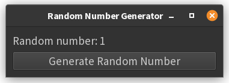

# 1. Introduction to Event Handling

Event handling is central to creating interactive GUI applications. In PyQt, events-such as button clicks, mouse
movements, or key presses-are managed using a powerful mechanism called **signals and slots**. This system allows you to
respond to user actions in a clean and decoupled way[1][4][5].

- **Signal:** An event notification emitted by a widget (e.g., a button emits a signal when clicked).
- **Slot:** A Python function or method that is called in response to a signal.

When a signal is emitted (for example, when a button is clicked), any connected slot is executed. This is the core of
event-driven programming in PyQt[1][4][5].

## Events Implemented Using Signals in Qt

In Qt (and therefore PyQt), most user actions (events) are implemented as signals.
Widgets emit signals when something happens (like a button being clicked), and you connect these signals to slots
(functions) to define what should happen in response[1][4][5].

## Example: Button Click Displays a Random Number

Below is a minimal PyQt6 example with a button and a label. When the button is clicked, a random integer between 1 and
100 (inclusive) is displayed in the label.

```python
import sys
import random
from PyQt6.QtWidgets import QApplication, QWidget, QVBoxLayout, QPushButton, QLabel


class RandomNumberApp(QWidget):
    def __init__(self):
        super().__init__()
        self.init_ui()

    def init_ui(self):
        self.layout = QVBoxLayout()

        self.label = QLabel("Click the button to get a random number!", self)
        self.button = QPushButton("Generate Random Number", self)

        self.layout.addWidget(self.label)
        self.layout.addWidget(self.button)
        self.setLayout(self.layout)

        # Connect the button's clicked signal to the slot (handler function)
        self.button.clicked.connect(self.show_random_number)

    def show_random_number(self):
        number = random.randint(1, 100)
        self.label.setText(f"Random number: {number}")


if __name__ == "__main__":
    app = QApplication(sys.argv)
    window = RandomNumberApp()
    window.setWindowTitle("Random Number Generator")
    window.show()
    sys.exit(app.exec())
```



**Key Points:**

- The `clicked` signal of the button is connected to the `show_random_number` method, which is called every time the
  button is pressed[4].
- The application uses `app.exec()` to start the event loop, as required in PyQt6[4].
- All widgets are imported from `PyQt6.QtWidgets`[4][5].

This is the recommended way to handle events (signals and slots) in PyQt6[4][5].

## Summary

- PyQt uses **signals and slots** for event handling.
- Signals are emitted by widgets when events occur (like a button click).
- Slots are functions that respond to those signals.
- Connecting signals to slots allows you to define interactive behaviors in your GUI[1][4][5].

This example demonstrates the basic pattern you'll use throughout PyQt development: connect widget signals to your own
functions to make your application respond to user actions.

??? note "References"
    - [1] https://www.tutorialspoint.com/pyqt/pyqt_signals_and_slots.htm
    - [2] https://www.tutorialspoint.com/pyqt/pyqt_event_handling.htm
    - [3] https://www.pythonguis.com/tutorials/pyqt-signals-slots-events/
    - [4] https://blog.heycoach.in/pyqt-event-handling/
    - [5] https://zetcode.com/gui/pyqt5/eventssignals/
    - [6] https://www.pythonguis.com/tutorials/pyqt-signals-slots-events/
    - [7] https://www.youtube.com/watch?v=N2JfygnWJaA
    - [8] https://doc.qt.io/qt-6/signalsandslots.html
    - [9] https://www.youtube.com/watch?v=3t8KhIdSGYQ
    - [10] https://www.techwithtim.net/tutorials/python-module-walk-throughs/pyqt5-tutorial/buttons-and-events
    - [11] https://www.linkedin.com/pulse/how-handle-widget-events-using-pyqt-signal-slot-mechanism-garcia
    - [12] https://stackoverflow.com/questions/72962792/brief-explanations-of-using-pyqt5-slots-signal-emit-and-connect
    - [13] https://www.w3resource.com/python-exercises/pyqt/pyqt_event_handling.php
    - [14] https://www.youtube.com/watch?v=yS_4PSRyovk
    - [15] https://www.tutorialspoint.com/pyqt5/pyqt5_signals_and_slots.htm
    - [16] https://pythonpyqt.com/pyqt-events/
    - [17] https://stackoverflow.com/questions/18567988/why-signals-and-slots-in-pyqt
    - [18] https://stackoverflow.com/questions/72713580/how-to-create-a-new-label-when-a-button-is-pressed-in-pyqt5
    - [19] https://stackoverflow.com/questions/45924498/how-to-change-label-text-until-pushbutton-clicked-in-pyqt/45924703
    - [20] https://forum.qt.io/topic/138880/strange-behaviour-of-qpushbutton
    - [21] https://stackoverflow.com/questions/10730131/create-dynamic-button-in-pyqt/10730209
    - [22] https://www.youtube.com/watch?v=9pl55MxZlG4
    - [23] https://discuss.streamlit.io/t/randomly-generate-a-number-and-save-this-number-and-user-input/20615
    - [24] https://www.pythonguis.com/tutorials/creating-multiple-windows/
    - [25] https://www.qtcentre.org/threads/67719-(PyQt4)-How-to-update-a-label-with-a-random-value-from-a-list
    - [26] https://realpython.com/python-gui-tkinter/
    - [27] https://forum.qt.io/topic/111831/dynamica-buttons-in-pyqt5
    - [28] https://forum.pythonguis.com/t/real-time-change-of-widgets/587
    - [29] https://forum.qt.io/topic/130419/pyqt5-how-to-change-qpushbutton-qlabel
    - [30] https://stackabuse.com/working-with-pythons-pyqt-framework/
    - [31] https://doc.qt.io/qtforpython-6/tutorials/basictutorial/signals_and_slots.html
    - [32] https://blog.heycoach.in/pyqt-signals-and-slots/
    - [33] https://wiki.qt.io/Qt_for_Python_Signals_and_Slots
    - [34] https://www.tutorialspoint.com/pyqt/pyqt_action_event.htm
    - [35] https://community.esri.com/t5/python-questions/random-number-of-a-random-number/td-p/581091
    - [36] https://www.reddit.com/r/learnpython/comments/gkylp6/pyqt5_update_label_on_button_click/
    - [37] https://stackoverflow.com/questions/44355154/generate-a-new-random-number-on-button-click
    - [38] https://forum.inductiveautomation.com/t/assigning-a-random-number-to-a-tag-on-a-button-click/15115
    - [39] https://stackoverflow.com/questions/48416936/pyqt5-update-labels-inrun-time/48477755
    - [40] https://stackoverflow.com/questions/56009884/how-to-have-qlabel-update-as-various-numbered-pushbuttons-are-clicked


---------------

??? info "Use of AI"
        Page written in part with the help of an AI assistant, mainly using Perplexity AI. The AI was used to generate
        explanations, examples and/or structure suggestions. All information has been verified, edited and completed by 
        the author.

