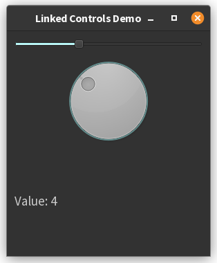

# 2. Example with a slider and a dial

Here's a PyQt6 example with a slider, dial, and label that stay synchronized (values 1-10):

```python
import sys
from PyQt6.QtWidgets import QApplication, QWidget, QSlider, QDial, QLabel, QVBoxLayout
from PyQt6.QtCore import Qt


class LinkedControlsApp(QWidget):
    def __init__(self):
        super().__init__()
        self.init_ui()

    def init_ui(self):
        layout = QVBoxLayout()

        # Create controls with range 1-10
        self.slider = QSlider(Qt.Orientation.Horizontal)
        self.dial = QDial()
        self.label = QLabel("Value: 1")

        # Set ranges
        self.slider.setRange(1, 10)
        self.dial.setRange(1, 10)

        # Add to layout
        layout.addWidget(self.slider)
        layout.addWidget(self.dial)
        layout.addWidget(self.label)
        self.setLayout(layout)

        # Connect signals with loop prevention
        self.slider.valueChanged.connect(self.update_controls)
        self.dial.valueChanged.connect(self.update_controls)

    def update_controls(self, value):
        # Prevent signal loops
        sender = self.sender()

        if isinstance(sender, QSlider):
            widget = self.dial 
        else:
            widget = self.slider

        widget.blockSignals(True)
        widget.setValue(value)
        widget.blockSignals(False)
        
        self.label.setText(f"Value: {value}")


if __name__ == "__main__":
    app = QApplication(sys.argv)
    window = LinkedControlsApp()
    window.setWindowTitle("Linked Controls Demo")
    window.show()
    sys.exit(app.exec())
```



**Key Features:**

1. **Synchronized Controls** (`QSlider` and `QDial`):
    - Moving either control updates the other instantly[4]
    - `blockSignals()` prevents infinite update loops[4]

2. **Value Display** (`QLabel`):
    - Automatically shows current value (1-10)
    - Updates on any control change

3. **Range Management**:
    - Both controls restricted to 1-10 using `setRange()`
    - Integer-only values by default

**Usage:**

- Slide the horizontal slider or rotate the dial
- Both controls and label will stay synchronized
- Values wrap automatically between 1 and 10

This demonstrates PyQt6's signal/slot mechanism while handling common synchronization challenges in GUI
development[1][4].

??? note "References"
     - [1] https://www.w3resource.com/python-exercises/pyqt/python-pyqt-connecting-signals-to-slots-exercise-10.php
     - [2] https://forum.qt.io/topic/44417/placing-a-label-next-to-a-slider-handle
     - [3] https://doc.qt.io/qtforpython-6/PySide6/QtWidgets/QRadioButton.html
     - [4] https://stackoverflow.com/questions/75156906/how-to-make-a-slider-which-has-a-label-can-show-above-the-handle-with-pyside2
     - [5] https://www.youtube.com/watch?v=Adg2zQaAF-g
     - [6] https://stackoverflow.com/questions/76745611/pyqt6-slider-not-moving
     - [7] https://stackoverflow.com/questions/43251692/how-to-make-button-like-radiobuttons-in-pyqt
     - [8] https://forum.qt.io/topic/159776/accessibility-issue-with-radio-buttons-in-pyqt6-setting
     - [9] https://www.reddit.com/r/Python/comments/wedvzi/what_is_the_best_gui_library_for_python/
     - [10] https://stackoverflow.com/questions/53532276/how-to-display-the-range-values-in-slider
     - [11] https://www.qtcentre.org/threads/3904-array-of-radio-buttons
     - [12] https://www.pythonguis.com/tutorials/pyqt6-widgets/
     - [13] https://doc.qt.io/qtforpython-5/PySide2/QtWidgets/QSlider.html
     - [14] https://www.pythonguis.com/tutorials/pyside6-widgets/
     - [15] https://forum.qt.io/topic/22609/qslider-needs-to-step-with-custom-step-value-on-mouse-slide
     - [16] https://coderslegacy.com/python/pyqt6-qradiobutton/
     - [17] https://pysdr.org/content/pyqt.html
     - [18] https://www.youtube.com/watch?v=DZ3-ij_JHE0
     - [19] https://stackoverflow.com/questions/68931326/how-switch-between-two-graphs-and-maintain-radio-button-and-slider-updates-worki
     - [20] https://stackoverflow.com/questions/47494941/python-pyqt4-qslider-interval-bigger-than-1
   

## Alternative version with an instance attribute

Here's a modified version of `LinkedControlsApp` that explicitly stores the current value in an instance attribute 
and uses a setter method to handle updates:

```python
import sys
from PyQt6.QtWidgets import QApplication, QWidget, QSlider, QDial, QLabel, QVBoxLayout
from PyQt6.QtCore import Qt

class LinkedControlsApp(QWidget):
    def __init__(self):
        super().__init__()
        self.current_value = 1  # Instance attribute storing the state
        self.init_ui()
        
    def init_ui(self):
        layout = QVBoxLayout()
        
        # Create controls with range 1-10
        self.slider = QSlider(Qt.Orientation.Horizontal)
        self.dial = QDial()
        self.label = QLabel(f"Value: {self.current_value}")
        
        # Set ranges
        self.slider.setRange(1, 10)
        self.dial.setRange(1, 10)
        
        # Add to layout
        layout.addWidget(self.slider)
        layout.addWidget(self.dial)
        layout.addWidget(self.label)
        self.setLayout(layout)
        
        # Connect signals to setter method
        self.slider.valueChanged.connect(self.set_current_value)
        self.dial.valueChanged.connect(self.set_current_value)
        
        # Initialize controls to current_value
        self.slider.setValue(self.current_value)
        self.dial.setValue(self.current_value)
    
    def set_current_value(self, value):
        """Setter method that updates the instance attribute and synchronizes widgets"""
        # Update the instance attribute
        self.current_value = value
        
        # Update other widget and label, blocking signals to avoid loops
        if self.sender() == self.slider:
            widget = self.dial
        else:
            widget = self.slider

        widget.blockSignals(True)
        widget.setValue(value)
        widget.blockSignals(False)
        
        self.label.setText(f"Value: {self.current_value}")

if __name__ == "__main__":
    app = QApplication(sys.argv)
    window = LinkedControlsApp()
    window.setWindowTitle("Stateful Linked Controls")
    window.show()
    sys.exit(app.exec())
```

**Key Improvements:**
1. **Explicit State Management**:
   - `self.current_value` stores the current state
   - All widget updates derive from this single source of truth

2. **Dedicated Setter Method**:
   - `set_current_value` handles state updates
   - Ensures state and UI remain synchronized
   - Prevents infinite loops using `blockSignals()`

3. **Initialization**:
   - Both controls initialized to `self.current_value`
   - Label shows initial value from the instance attribute

4. **Encapsulation**:
   - State modification happens only through the setter
   - UI updates are centralized in one method

**Usage Notes:**
- The instance attribute (`current_value`) acts as the source of truth
- Any external modifications to `current_value` should go through `set_current_value`
- The setter ensures all widgets and the label stay synchronized
- Signal blocking prevents infinite update loops between connected widgets

This pattern provides a clear separation between state management and UI updates, making it easier to extend or 
modify the behavior later.


---------------

??? info "Use of AI"
        Page written in part with the help of an AI assistant, mainly using Perplexity AI. The AI was used to generate
        explanations, examples and/or structure suggestions. All information has been verified, edited and completed by 
        the author.