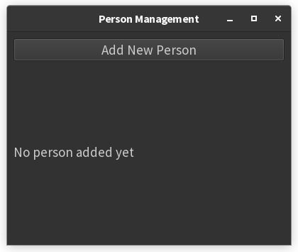
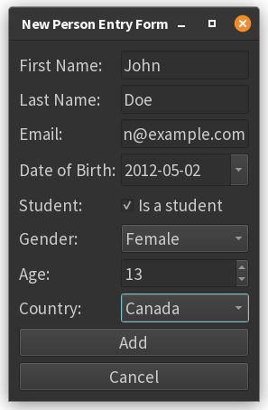
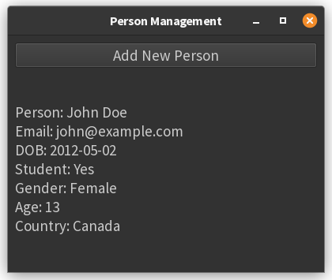
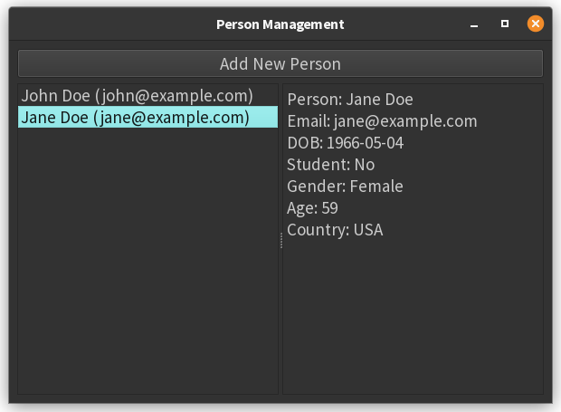

# 4. Submitting form data

Here's a modified version of the previous form layout example, this time with signals to react to button clicks :

```python
import sys
from PyQt6.QtWidgets import (
    QApplication, QMainWindow, QWidget, QFormLayout, QLineEdit,
    QDateEdit, QCheckBox, QComboBox, QSpinBox, QPushButton, QLabel, QVBoxLayout
)
from PyQt6.QtCore import QDate, pyqtSignal

class Person:
    def __init__(self, first_name, last_name, email, dob, is_student, gender, age, country):
        self.first_name = first_name
        self.last_name = last_name
        self.email = email
        self.dob = dob
        self.is_student = is_student
        self.gender = gender
        self.age = age
        self.country = country
        
    def __str__(self):
        return (f"Person: {self.first_name} {self.last_name}\n"
                f"Email: {self.email}\n"
                f"DOB: {self.dob.toString('yyyy-MM-dd')}\n"
                f"Student: {'Yes' if self.is_student else 'No'}\n"
                f"Gender: {self.gender}\n"
                f"Age: {self.age}\n"
                f"Country: {self.country}")

class PersonForm(QWidget):
    person_added = pyqtSignal(object)  # Signal to emit when person is added
    
    def __init__(self):
        super().__init__()
        self.setWindowTitle("New Person Entry Form")
        self.setup_ui()

    def setup_ui(self):
        layout = QFormLayout()

        # Form fields
        self.first_name_edit = QLineEdit()
        self.last_name_edit = QLineEdit()
        self.email_edit = QLineEdit()
        self.dob_edit = QDateEdit()
        self.dob_edit.setCalendarPopup(True)
        self.dob_edit.setDate(QDate.currentDate())
        self.student_checkbox = QCheckBox("Is a student")
        self.gender_combo = QComboBox()
        self.gender_combo.addItems(["Select...", "Female", "Male", "Other"])
        self.age_spin = QSpinBox()
        self.age_spin.setRange(0, 120)
        self.country_combo = QComboBox()
        self.country_combo.addItems(["Select...", "Canada", "USA", "Other"])

        # Add fields to layout
        layout.addRow("First Name:", self.first_name_edit)
        layout.addRow("Last Name:", self.last_name_edit)
        layout.addRow("Email:", self.email_edit)
        layout.addRow("Date of Birth:", self.dob_edit)
        layout.addRow("Student:", self.student_checkbox)
        layout.addRow("Gender:", self.gender_combo)
        layout.addRow("Age:", self.age_spin)
        layout.addRow("Country:", self.country_combo)

        # Buttons
        button_layout = QVBoxLayout()
        self.add_button = QPushButton("Add")
        self.cancel_button = QPushButton("Cancel")
        
        self.add_button.clicked.connect(self.create_person)
        self.cancel_button.clicked.connect(self.close)
        
        button_layout.addWidget(self.add_button)
        button_layout.addWidget(self.cancel_button)
        layout.addRow(button_layout)

        self.setLayout(layout)

    def create_person(self):
        # Create Person object from form data
        person = Person(
            first_name=self.first_name_edit.text(),
            last_name=self.last_name_edit.text(),
            email=self.email_edit.text(),
            dob=self.dob_edit.date(),
            is_student=self.student_checkbox.isChecked(),
            gender=self.gender_combo.currentText(),
            age=self.age_spin.value(),
            country=self.country_combo.currentText()
        )
        self.person_added.emit(person)
        self.close()

class MainWindow(QMainWindow):
    def __init__(self):
        super().__init__()
        self.person = None
        self.setup_ui()

    def setup_ui(self):
        central_widget = QWidget()
        layout = QVBoxLayout()
        
        # Add Person button
        self.open_form_button = QPushButton("Add New Person")
        self.open_form_button.clicked.connect(self.show_form)
        
        # Display label
        self.person_label = QLabel("No person added yet")
        
        layout.addWidget(self.open_form_button)
        layout.addWidget(self.person_label)
        central_widget.setLayout(layout)
        
        self.setCentralWidget(central_widget)
        self.setWindowTitle("Person Management")
        self.setMinimumSize(400, 300)

    def show_form(self):
        self.form = PersonForm()
        self.form.person_added.connect(self.handle_new_person)
        self.form.show()

    def handle_new_person(self, person):
        self.person = person
        self.person_label.setText(str(person))

if __name__ == "__main__":
    app = QApplication(sys.argv)
    window = MainWindow()
    window.show()
    sys.exit(app.exec())
```







### Key Changes and Features

1. **Main Window Structure**:
    - Added `MainWindow` class as the primary interface
    - Contains "Add New Person" button and display label

2. **Form Display Logic**:
    - Form only appears when clicking "Add New Person"
    - Uses `show()` instead of `exec()` for non-modal dialog

3. **Person Class**:
    - Defined with all form fields as attributes
    - Includes `__str__` method for display formatting

4. **Signal Handling**:
    - `PersonForm` emits `person_added` signal with Person object
    - `MainWindow` connects to this signal to update display

5. **Button Functionality**:
    - Add button creates Person object and closes form
    - Cancel button immediately closes form
    - Both buttons clear the form on next opening (due to new instance)

6. **Data Flow**:
    - Form data is encapsulated in Person object
    - Main window stores latest Person instance
    - Label updates automatically when new person is added

### Usage Flow

1. Run the application to see main window
2. Click "Add New Person" to open form
3. Fill form and click:
    - **Add**: Creates person, updates label, closes form
    - **Cancel**: Closes form without saving
4. New person details appear in main window label after adding

This implementation demonstrates proper separation of concerns between the form and main window, while maintaining 
clean data flow through PyQt6's signal/slot mechanism.

## Another version with a list of Person objects

### Summary of Changes

#### 1. Person Class

- **Short Display:** Implement `__str__` to return a brief summary (e.g., `"First Last (email)"`) for use in the list.
- **Detailed Display:** Move the original detailed string to `__repr__` for showing full details on the right.

#### 2. MainWindow Class

- **Person List:** Replace the single `person` attribute with a `self.people` list to store multiple `Person` objects.
- **UI Layout:** Use a `QSplitter` as the main layout, with:
    - A `QListWidget` on the left to display the list of people (using `str(person)`).
    - A `QTextEdit` (set to read-only) on the right to display details (`repr(person)`).
- **Adding People:** When a new person is added, append it to `self.people` and add its string to the `QListWidget`.
- **Selection Handling:** Connect the `currentRowChanged` signal of the `QListWidget` to a method that displays the 
  corresponding person's details in the `QTextEdit`.

#### 3. Other

- **No changes** needed to the form logic or person creation, except possibly clearing the form after adding.

### Result  



You now have a master-detail interface:  

- The left side lists all people in the app.  
- The right side shows detailed information for the selected person.  
- New people can be added and will appear in the list immediately.


```python
import sys
from PyQt6.QtWidgets import (
    QApplication, QMainWindow, QWidget, QFormLayout, QLineEdit,
    QDateEdit, QCheckBox, QComboBox, QSpinBox, QPushButton, QVBoxLayout, QTextEdit, QListWidget, QSplitter
)
from PyQt6.QtCore import QDate, pyqtSignal


class Person:
    def __init__(self, first_name, last_name, email, dob, is_student, gender, age, country):
        self.first_name = first_name
        self.last_name = last_name
        self.email = email
        self.dob = dob
        self.is_student = is_student
        self.gender = gender
        self.age = age
        self.country = country

    def __str__(self):
        # Short version for list display
        return f"{self.first_name} {self.last_name} ({self.email})"

    def __repr__(self):
        # Detailed version for detail display
        return (f"Person: {self.first_name} {self.last_name}\n"
                f"Email: {self.email}\n"
                f"DOB: {self.dob.toString('yyyy-MM-dd')}\n"
                f"Student: {'Yes' if self.is_student else 'No'}\n"
                f"Gender: {self.gender}\n"
                f"Age: {self.age}\n"
                f"Country: {self.country}")


class PersonForm(QWidget):
    person_added = pyqtSignal(object)  # Signal to emit when person is added

    def __init__(self):
        super().__init__()
        self.setWindowTitle("New Person Entry Form")
        self.setup_ui()

    def setup_ui(self):
        layout = QFormLayout()

        # Form fields
        self.first_name_edit = QLineEdit()
        self.last_name_edit = QLineEdit()
        self.email_edit = QLineEdit()
        self.dob_edit = QDateEdit()
        self.dob_edit.setCalendarPopup(True)
        self.dob_edit.setDate(QDate.currentDate())
        self.student_checkbox = QCheckBox("Is a student")
        self.gender_combo = QComboBox()
        self.gender_combo.addItems(["Select...", "Female", "Male", "Other"])
        self.age_spin = QSpinBox()
        self.age_spin.setRange(0, 120)
        self.country_combo = QComboBox()
        self.country_combo.addItems(["Select...", "Canada", "USA", "Other"])

        # Add fields to layout
        layout.addRow("First Name:", self.first_name_edit)
        layout.addRow("Last Name:", self.last_name_edit)
        layout.addRow("Email:", self.email_edit)
        layout.addRow("Date of Birth:", self.dob_edit)
        layout.addRow("Student:", self.student_checkbox)
        layout.addRow("Gender:", self.gender_combo)
        layout.addRow("Age:", self.age_spin)
        layout.addRow("Country:", self.country_combo)

        # Buttons
        button_layout = QVBoxLayout()
        self.add_button = QPushButton("Add")
        self.cancel_button = QPushButton("Cancel")

        self.add_button.clicked.connect(self.create_person)
        self.cancel_button.clicked.connect(self.close)

        button_layout.addWidget(self.add_button)
        button_layout.addWidget(self.cancel_button)
        layout.addRow(button_layout)

        self.setLayout(layout)

    def create_person(self):
        # Create Person object from form data
        person = Person(
            first_name=self.first_name_edit.text(),
            last_name=self.last_name_edit.text(),
            email=self.email_edit.text(),
            dob=self.dob_edit.date(),
            is_student=self.student_checkbox.isChecked(),
            gender=self.gender_combo.currentText(),
            age=self.age_spin.value(),
            country=self.country_combo.currentText()
        )
        self.person_added.emit(person)
        self.close()


class MainWindow(QMainWindow):
    def __init__(self):
        super().__init__()
        self.people = []  # List of Person objects
        self.setup_ui()

    def setup_ui(self):
        splitter = QSplitter()

        # List widget for people
        self.person_list = QListWidget()
        self.person_list.currentRowChanged.connect(self.display_person_details)

        # Detail display (read-only)
        self.person_detail = QTextEdit()
        self.person_detail.setReadOnly(True)

        splitter.addWidget(self.person_list)
        splitter.addWidget(self.person_detail)

        # Add Person button above the splitter
        central_widget = QWidget()
        layout = QVBoxLayout()
        self.open_form_button = QPushButton("Add New Person")
        self.open_form_button.clicked.connect(self.show_form)
        layout.addWidget(self.open_form_button)
        layout.addWidget(splitter)
        central_widget.setLayout(layout)
        self.setCentralWidget(central_widget)
        self.setWindowTitle("Person Management")
        self.setMinimumSize(600, 400)

    def handle_new_person(self, person):
        self.people.append(person)
        self.person_list.addItem(str(person))

    def show_form(self):
        self.form = PersonForm()
        self.form.person_added.connect(self.handle_new_person)
        self.form.show()
        
    def display_person_details(self, row):
        if 0 <= row < len(self.people):
            self.person_detail.setPlainText(repr(self.people[row]))
        else:
            self.person_detail.clear()


if __name__ == "__main__":
    app = QApplication(sys.argv)
    window = MainWindow()
    window.show()
    sys.exit(app.exec())
```


---------------

??? info "Use of AI"
    Page written in part with the help of an AI assistant, mainly using Perplexity AI. The AI was used to generate
    explanations, examples and/or structure suggestions. All information has been verified, edited and completed by
    the author.