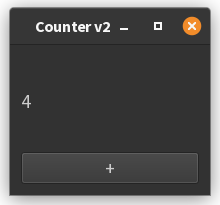
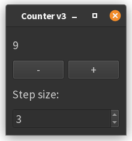
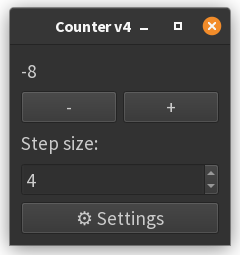
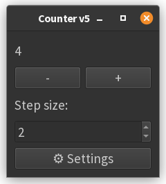
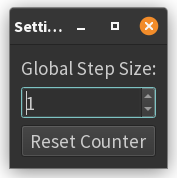
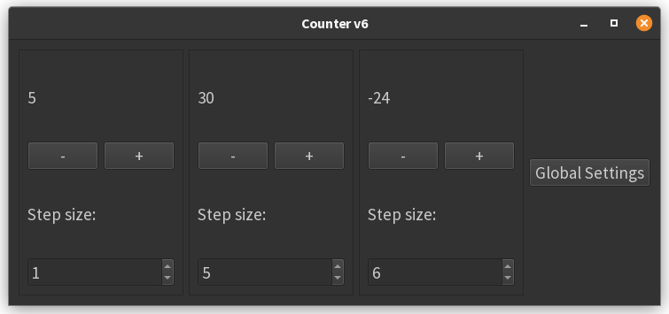
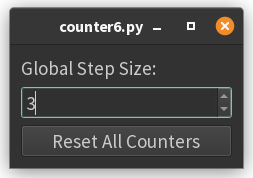

# 2. Counter Application: Solutions

Here's a complete solution series with explanations for each part of the counter exercise:

Here are the solutions for each exercise, rewritten for **PyQt6**. Key PyQt6 differences include:

- Enums (like alignment or check state) must use their fully qualified names (e.g., `Qt.AlignmentFlag.AlignCenter` 
- instead of `Qt.AlignCenter`)[1][2][5].
- The `exec_()` method is now just `exec()`[3].
- Some imports may change slightly.

Each version below is named `counter1.py`, `counter2.py`, etc., with explanations of the code and changes.

---

## **counter1.py – Basic Layout**


```python
import sys
from PyQt6.QtWidgets import QApplication, QWidget, QVBoxLayout, QLabel, QPushButton

class CounterApp(QWidget):
    def __init__(self):
        super().__init__()
        self.setWindowTitle("Counter v1")

        self.layout = QVBoxLayout()
        self.display = QLabel("0")
        self.inc_btn = QPushButton("+")

        self.layout.addWidget(self.display)
        self.layout.addWidget(self.inc_btn)
        self.setLayout(self.layout)
        self.resize(200, 150)

if __name__ == "__main__":
    app = QApplication(sys.argv)
    window = CounterApp()
    window.show()
    sys.exit(app.exec())
```

**Explanation:**  

- Basic window with a label and a "+" button, arranged vertically.
- No functionality yet.

---

## **counter2.py – Basic Increment**



```python
import sys
from PyQt6.QtWidgets import QApplication, QWidget, QVBoxLayout, QLabel, QPushButton

class CounterApp(QWidget):
    def __init__(self):
        super().__init__()
        self.setWindowTitle("Counter v2")
        self.counter = 0

        self.layout = QVBoxLayout()
        self.display = QLabel("0")
        self.inc_btn = QPushButton("+")

        self.layout.addWidget(self.display)
        self.layout.addWidget(self.inc_btn)
        self.setLayout(self.layout)
        self.resize(200, 150)

        self.inc_btn.clicked.connect(self.increment)

    def increment(self):
        self.counter += 1
        self.display.setText(str(self.counter))

if __name__ == "__main__":
    app = QApplication(sys.argv)
    window = CounterApp()
    window.show()
    sys.exit(app.exec())
```

**Changes:**  

- Added a counter variable.
- Connected the "+" button to increment the counter and update the label.

---

## **counter3.py – Add Decrement and Step Control**



```python
import sys
from PyQt6.QtWidgets import (
    QApplication, QWidget, QVBoxLayout, QLabel, QPushButton,
    QSpinBox, QHBoxLayout
)

class CounterApp(QWidget):
    def __init__(self):
        super().__init__()
        self.setWindowTitle("Counter v3")
        self.counter = 0

        self.layout = QVBoxLayout()
        self.display = QLabel("0")

        # Buttons
        self.inc_btn = QPushButton("+")
        self.dec_btn = QPushButton("-")

        # Step size input
        self.step_input = QSpinBox()
        self.step_input.setValue(1)

        # Button layout
        btn_layout = QHBoxLayout()
        btn_layout.addWidget(self.dec_btn)
        btn_layout.addWidget(self.inc_btn)

        self.layout.addWidget(self.display)
        self.layout.addLayout(btn_layout)
        self.layout.addWidget(QLabel("Step size:"))
        self.layout.addWidget(self.step_input)
        self.setLayout(self.layout)
        self.resize(200, 180)

        self.inc_btn.clicked.connect(self.increment)
        self.dec_btn.clicked.connect(self.decrement)

    def increment(self):
        self.counter += self.step_input.value()
        self.display.setText(str(self.counter))

    def decrement(self):
        self.counter -= self.step_input.value()
        self.display.setText(str(self.counter))

if __name__ == "__main__":
    app = QApplication(sys.argv)
    window = CounterApp()
    window.show()
    sys.exit(app.exec())
```

**Changes:**  

- Added a "-" button for decrementing.
- Added a `QSpinBox` for step size.
- Both increment and decrement use the step value.

---

## **counter4.py – Settings Window with Custom Signal**




```python
import sys
from PyQt6.QtWidgets import (
    QApplication, QWidget, QVBoxLayout, QLabel, QPushButton,
    QSpinBox, QHBoxLayout
)
from PyQt6.QtCore import pyqtSignal

class SettingsWindow(QWidget):
    step_changed = pyqtSignal(int)

    def __init__(self):
        super().__init__()
        self.setWindowTitle("Settings")
        layout = QVBoxLayout()
        self.step_control = QSpinBox()
        self.step_control.setValue(1)
        layout.addWidget(QLabel("Global Step Size:"))
        layout.addWidget(self.step_control)
        self.setLayout(layout)
        self.resize(150, 100)

        self.step_control.valueChanged.connect(
            lambda value: self.step_changed.emit(value)
        )

class CounterApp(QWidget):
    def __init__(self):
        super().__init__()
        self.setWindowTitle("Counter v4")
        self.counter = 0

        self.layout = QVBoxLayout()
        self.display = QLabel("0")
        self.inc_btn = QPushButton("+")
        self.dec_btn = QPushButton("-")
        self.step_input = QSpinBox()
        self.step_input.setValue(1)

        btn_layout = QHBoxLayout()
        btn_layout.addWidget(self.dec_btn)
        btn_layout.addWidget(self.inc_btn)

        self.layout.addWidget(self.display)
        self.layout.addLayout(btn_layout)
        self.layout.addWidget(QLabel("Step size:"))
        self.layout.addWidget(self.step_input)

        self.settings_btn = QPushButton("⚙ Settings")
        self.layout.addWidget(self.settings_btn)
        self.setLayout(self.layout)
        self.resize(220, 200)

        self.inc_btn.clicked.connect(self.increment)
        self.dec_btn.clicked.connect(self.decrement)

        # Settings window
        self.settings_window = SettingsWindow()
        self.settings_btn.clicked.connect(self.settings_window.show)
        self.settings_window.step_changed.connect(self.step_input.setValue)

    def increment(self):
        self.counter += self.step_input.value()
        self.display.setText(str(self.counter))

    def decrement(self):
        self.counter -= self.step_input.value()
        self.display.setText(str(self.counter))

if __name__ == "__main__":
    app = QApplication(sys.argv)
    window = CounterApp()
    window.show()
    sys.exit(app.exec())
```

**Changes:** 

- Added a separate settings window with its own spin box.
- Used a custom signal (`step_changed`) to update the main window's step size.
- Settings window is shown with a button.

---

## **counter5.py – Reset Feature via Settings Window**





```python
import sys
from PyQt6.QtWidgets import (
    QApplication, QWidget, QVBoxLayout, QLabel, QPushButton,
    QSpinBox, QHBoxLayout
)
from PyQt6.QtCore import pyqtSignal

class SettingsWindow(QWidget):
    step_changed = pyqtSignal(int)
    reset_requested = pyqtSignal()

    def __init__(self):
        super().__init__()
        self.setWindowTitle("Settings")
        layout = QVBoxLayout()
        self.step_control = QSpinBox()
        self.step_control.setValue(1)
        layout.addWidget(QLabel("Global Step Size:"))
        layout.addWidget(self.step_control)

        self.reset_btn = QPushButton("Reset Counter")
        layout.addWidget(self.reset_btn)
        self.setLayout(layout)
        self.resize(150, 120)

        self.step_control.valueChanged.connect(
            lambda value: self.step_changed.emit(value)
        )
        self.reset_btn.clicked.connect(self.reset_requested.emit)

class CounterApp(QWidget):
    def __init__(self):
        super().__init__()
        self.setWindowTitle("Counter v5")
        self.counter = 0

        self.layout = QVBoxLayout()
        self.display = QLabel("0")
        self.inc_btn = QPushButton("+")
        self.dec_btn = QPushButton("-")
        self.step_input = QSpinBox()
        self.step_input.setValue(1)

        btn_layout = QHBoxLayout()
        btn_layout.addWidget(self.dec_btn)
        btn_layout.addWidget(self.inc_btn)

        self.layout.addWidget(self.display)
        self.layout.addLayout(btn_layout)
        self.layout.addWidget(QLabel("Step size:"))
        self.layout.addWidget(self.step_input)

        self.settings_btn = QPushButton("⚙ Settings")
        self.layout.addWidget(self.settings_btn)
        self.setLayout(self.layout)
        self.resize(220, 210)

        self.inc_btn.clicked.connect(self.increment)
        self.dec_btn.clicked.connect(self.decrement)

        # Settings window
        self.settings_window = SettingsWindow()
        self.settings_btn.clicked.connect(self.settings_window.show)
        self.settings_window.step_changed.connect(self.step_input.setValue)
        self.settings_window.reset_requested.connect(self.reset_counter)

    def increment(self):
        self.counter += self.step_input.value()
        self.display.setText(str(self.counter))

    def decrement(self):
        self.counter -= self.step_input.value()
        self.display.setText(str(self.counter))

    def reset_counter(self):
        self.counter = 0
        self.display.setText("0")
        self.step_input.setValue(1)

if __name__ == "__main__":
    app = QApplication(sys.argv)
    window = CounterApp()
    window.show()
    sys.exit(app.exec())
```

**Changes:**  

- Added a "Reset Counter" button to the settings window.
- Introduced a new custom signal (`reset_requested`) for reset.
- Main window resets counter and step size when reset is requested.

---


## **counter6.py - Multi-Counter System**





```python
import sys
from PyQt6.QtWidgets import (
    QApplication, QWidget, QVBoxLayout, QLabel, QPushButton,
    QSpinBox, QHBoxLayout
)
from PyQt6.QtCore import pyqtSignal


class SettingsWindow(QWidget):
    step_changed = pyqtSignal(int)
    reset_requested = pyqtSignal()

    def __init__(self):
        super().__init__()
        self.setWindowTitle("Settings")
        layout = QVBoxLayout()
        self.step_control = QSpinBox()
        self.step_control.setValue(1)
        layout.addWidget(QLabel("Global Step Size:"))
        layout.addWidget(self.step_control)

        self.reset_btn = QPushButton("Reset Counter")
        layout.addWidget(self.reset_btn)
        self.setLayout(layout)
        self.resize(150, 120)

        self.step_control.valueChanged.connect(
            lambda value: self.step_changed.emit(value)
        )
        self.reset_btn.clicked.connect(self.reset_requested.emit)


class CounterApp(QWidget):
    def __init__(self):
        super().__init__()
        self.setWindowTitle("Counter v5")
        self.counter = 0

        self.layout = QVBoxLayout()
        self.display = QLabel("0")
        self.inc_btn = QPushButton("+")
        self.dec_btn = QPushButton("-")
        self.step_input = QSpinBox()
        self.step_input.setValue(1)

        btn_layout = QHBoxLayout()
        btn_layout.addWidget(self.dec_btn)
        btn_layout.addWidget(self.inc_btn)

        self.layout.addWidget(self.display)
        self.layout.addLayout(btn_layout)
        self.layout.addWidget(QLabel("Step size:"))
        self.layout.addWidget(self.step_input)

        self.settings_btn = QPushButton("⚙ Settings")
        self.layout.addWidget(self.settings_btn)
        self.setLayout(self.layout)
        self.resize(220, 210)

        self.inc_btn.clicked.connect(self.increment)
        self.dec_btn.clicked.connect(self.decrement)

        # Settings window
        self.settings_window = SettingsWindow()
        self.settings_btn.clicked.connect(self.settings_window.show)
        self.settings_window.step_changed.connect(self.step_input.setValue)
        self.settings_window.reset_requested.connect(self.reset_counter)

    def increment(self):
        self.counter += self.step_input.value()
        self.display.setText(str(self.counter))

    def decrement(self):
        self.counter -= self.step_input.value()
        self.display.setText(str(self.counter))

    def reset_counter(self):
        self.counter = 0
        self.display.setText("0")
        self.step_input.setValue(1)  # probably not necessary

    def closeEvent(self, event):
        self.settings_window.close()
        event.accept()


if __name__ == "__main__":
    app = QApplication(sys.argv)
    window = CounterApp()
    window.show()
    sys.exit(app.exec())

```

**Key Changes/Additions:**  

1. **Reusable `CounterWidget`:**  
    - Encapsulates all counter functionality in a self-contained widget
    - Can be instantiated multiple times
    - Has built-in reset capability

2. **Bulk Signal Connections:**  
    - Settings window's `step_changed` updates all counters' step inputs
    - `reset_requested` triggers resets on all counters
    - Uses list comprehensions to apply changes to all instances

3. **Visual Separation:**
    - Uses `QFrame` with styled panel for visual distinction
    - Vertical layout stacks multiple counters

4. **Close Event:**
    - Redefined the `closeEvent()` method in the `CounterApp` class to close the settings window at the same time as 
      close the main window
   
    ```python
    def closeEvent(self, event):
        self.settings_window.close()
        event.accept()
    ```


??? note "References"

      - [1] https://stackoverflow.com/questions/72086632/migrating-to-qt6-pyqt6-what-are-all-the-deprecated-short-form-names-in-qt5
      - [2] https://www.pythonguis.com/pyqt6-tutorial/
      - [3] https://zetcode.com/pyqt6/firstprograms/
      - [4] https://github.com/bit-team/backintime/issues/1301
      - [5] https://www.pythonguis.com/faq/about-pyqt6-and-pyside6/
      - [6] https://www.youtube.com/watch?v=nrUFM0NXNG4
      - [7] https://stackoverflow.com/questions/67167123/differences-in-pyside6-and-pyqt5
      - [8] https://github.com/janbodnar/PyQt6-Tutorial-Examples/blob/main/events/signals_slots.py
      - [9] https://realpython.com/python-pyqt-gui-calculator/
      - [10] https://stackoverflow.com/questions/76281633/migrate-a-qkeysequence-from-pyqt5-to-pyqt6
      - [11] https://github.com/qutebrowser/qutebrowser/issues/7370
      - [12] https://zetcode.com/pyqt6/eventssignals/
      - [13] https://www.pythonguis.com/tutorials/pyqt6-creating-your-first-window/
      - [14] https://github.com/ZELLMECHANIK-DRESDEN/ShapeOut2/issues/165
      - [15] https://www.youtube.com/watch?v=upvU3d6NAvs
      - [16] https://github.com/pyqt/examples
      - [17] https://www.reddit.com/r/learnpython/comments/l3m4gq/how_similar_are_pyqt6_and_pyqt5/
      - [18] https://discuss.python.org/t/from-pyqt5-to-pyqt6/28043
      - [19] https://learn.foundry.com/katana/dev-guide/Qt6Migration.html
      - [20] https://doc.qt.io/qtforpython-6/tutorials/basictutorial/signals_and_slots.html


---------------

??? info "Use of AI"
    Page written in part with the help of an AI assistant, mainly using Perplexity AI. The AI was used to generate
    explanations, examples and/or structure suggestions. All information has been verified, edited and completed by
    the author.