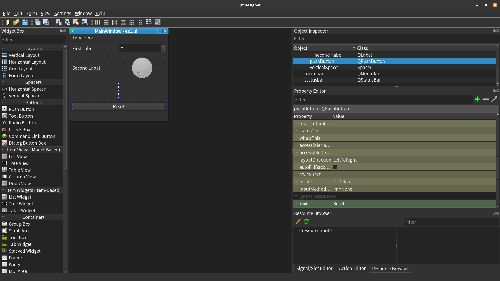

# 2. Simple example using Qt Designer



??? note "`ex1.ui`"
    ```xml
    <?xml version="1.0" encoding="UTF-8"?>
    <ui version="4.0">
     <class>MainWindow</class>
     <widget class="QMainWindow" name="MainWindow">
      <property name="geometry">
       <rect>
        <x>0</x>
        <y>0</y>
        <width>376</width>
        <height>333</height>
       </rect>
      </property>
      <property name="windowTitle">
       <string>MainWindow</string>
      </property>
      <widget class="QWidget" name="centralwidget">
       <layout class="QVBoxLayout" name="verticalLayout">
        <item>
         <layout class="QHBoxLayout" name="horizontalLayout">
          <item>
           <widget class="QLabel" name="first_label">
            <property name="text">
             <string>First Label</string>
            </property>
           </widget>
          </item>
          <item>
           <widget class="QSpinBox" name="spinBox"/>
          </item>
         </layout>
        </item>
        <item>
         <layout class="QHBoxLayout" name="horizontalLayout_2">
          <item>
           <widget class="QLabel" name="second_label">
            <property name="text">
             <string>Second Label</string>
            </property>
           </widget>
          </item>
          <item>
           <widget class="QDial" name="dial"/>
          </item>
         </layout>
        </item>
        <item>
         <spacer name="verticalSpacer">
          <property name="orientation">
           <enum>Qt::Vertical</enum>
          </property>
          <property name="sizeHint" stdset="0">
           <size>
            <width>20</width>
            <height>40</height>
           </size>
          </property>
         </spacer>
        </item>
        <item>
         <widget class="QPushButton" name="pushButton">
          <property name="text">
           <string>Reset</string>
          </property>
         </widget>
        </item>
       </layout>
      </widget>
      <widget class="QMenuBar" name="menubar">
       <property name="geometry">
        <rect>
         <x>0</x>
         <y>0</y>
         <width>376</width>
         <height>29</height>
        </rect>
       </property>
      </widget>
      <widget class="QStatusBar" name="statusbar"/>
     </widget>
     <resources/>
     <connections/>
    </ui>
    ```


!!! note "Load the UI directly"
    ```python
    import sys
    from PyQt6 import QtWidgets
    from PyQt6 import uic
    
    
    class MainWindow(QtWidgets.QMainWindow):
    
        def __init__(self, *args, **kwargs):
            super().__init__(*args, **kwargs)
            uic.loadUi("ex1.ui", self)
    
    
    app = QtWidgets.QApplication(sys.argv)
    window = MainWindow()
    window.show()
    app.exec()
    ```

Convert the `.ui` file with `pyuic6 ex1.ui -o MainWindow.py`

??? note "`MainWindow.py`"
    ```python
    # Form implementation generated from reading ui file 'ex1.ui'
    #
    # Created by: PyQt6 UI code generator 6.9.0
    #
    # WARNING: Any manual changes made to this file will be lost when pyuic6 is
    # run again.  Do not edit this file unless you know what you are doing.
    
    
    from PyQt6 import QtCore, QtGui, QtWidgets
    
    
    class Ui_MainWindow(object):
        def setupUi(self, MainWindow):
            MainWindow.setObjectName("MainWindow")
            MainWindow.resize(376, 333)
            self.centralwidget = QtWidgets.QWidget(parent=MainWindow)
            self.centralwidget.setObjectName("centralwidget")
            self.verticalLayout = QtWidgets.QVBoxLayout(self.centralwidget)
            self.verticalLayout.setObjectName("verticalLayout")
            self.horizontalLayout = QtWidgets.QHBoxLayout()
            self.horizontalLayout.setObjectName("horizontalLayout")
            self.first_label = QtWidgets.QLabel(parent=self.centralwidget)
            self.first_label.setObjectName("first_label")
            self.horizontalLayout.addWidget(self.first_label)
            self.spinBox = QtWidgets.QSpinBox(parent=self.centralwidget)
            self.spinBox.setObjectName("spinBox")
            self.horizontalLayout.addWidget(self.spinBox)
            self.verticalLayout.addLayout(self.horizontalLayout)
            self.horizontalLayout_2 = QtWidgets.QHBoxLayout()
            self.horizontalLayout_2.setObjectName("horizontalLayout_2")
            self.second_label = QtWidgets.QLabel(parent=self.centralwidget)
            self.second_label.setObjectName("second_label")
            self.horizontalLayout_2.addWidget(self.second_label)
            self.dial = QtWidgets.QDial(parent=self.centralwidget)
            self.dial.setObjectName("dial")
            self.horizontalLayout_2.addWidget(self.dial)
            self.verticalLayout.addLayout(self.horizontalLayout_2)
            spacerItem = QtWidgets.QSpacerItem(20, 40, QtWidgets.QSizePolicy.Policy.Minimum, QtWidgets.QSizePolicy.Policy.Expanding)
            self.verticalLayout.addItem(spacerItem)
            self.pushButton = QtWidgets.QPushButton(parent=self.centralwidget)
            self.pushButton.setObjectName("pushButton")
            self.verticalLayout.addWidget(self.pushButton)
            MainWindow.setCentralWidget(self.centralwidget)
            self.menubar = QtWidgets.QMenuBar(parent=MainWindow)
            self.menubar.setGeometry(QtCore.QRect(0, 0, 376, 29))
            self.menubar.setObjectName("menubar")
            MainWindow.setMenuBar(self.menubar)
            self.statusbar = QtWidgets.QStatusBar(parent=MainWindow)
            self.statusbar.setObjectName("statusbar")
            MainWindow.setStatusBar(self.statusbar)
    
            self.retranslateUi(MainWindow)
            QtCore.QMetaObject.connectSlotsByName(MainWindow)
    
        def retranslateUi(self, MainWindow):
            _translate = QtCore.QCoreApplication.translate
            MainWindow.setWindowTitle(_translate("MainWindow", "MainWindow"))
            self.first_label.setText(_translate("MainWindow", "First Label"))
            self.second_label.setText(_translate("MainWindow", "Second Label"))
            self.pushButton.setText(_translate("MainWindow", "Reset"))
    ```


Use the generated `UI_MainWindow` class, and add a *signal/slot* connection.
```python
import sys
from PyQt6 import QtWidgets, uic

from MainWindow import Ui_MainWindow


class MainWindow(QtWidgets.QMainWindow, Ui_MainWindow):
    def __init__(self, *args, obj=None, **kwargs):
        super().__init__(*args, **kwargs)
        self.setupUi(self)

        self.pushButton.clicked.connect(lambda: self.spinBox.setValue(0))


if __name__ == "__main__":
    app = QtWidgets.QApplication(sys.argv)

    window = MainWindow()
    window.show()
    app.exec()
```
